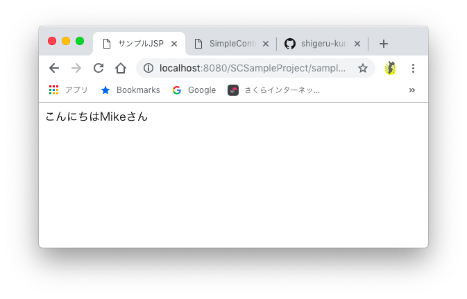

# SimpleController4Jを始める

## 概要
このページでは、SimpleController4Jの使用方法をご説明していきます。
Visual Studio CodeでMavenプロジェクトを作成し、SimpleController4Jを使用して、 簡単なWEBアプリケーションを作成していきます。

## リポジトリのクローン
Githubの「SimpleController4J」のリポジトリをクローンします。
※事前にGtiをインストールしておいてください。  
- [リポジトリ](https://github.com/shigeru-kuratani/SimpleController4J)

## ローカル環境にインストール
ターミナルでクローンしたディレクトリに移動して、以下のコマンドを実行し、ローカル環境にSimpleController4Jをインストールします。
```
mvn install
```
※事前にMavenをインストールしておいてください。

## WEBプロジェクトの作成
Visual Studio Codeで以下のコマンドを実行して、MavenのWEBプロジェクトを作成します。
```
Create Java Project
```
※Javaプロジェクトを作成する際に、Mavenを選択してください。  
※Mavenプロジェクト作成時にWEBアーキタイプを選択してください。

## pom.xmlの修正
pom.xmlに以下の依存ライブラリを追加します。
```
<dependency>
    <groupId>net.skuratani.simplecontroller4j</groupId>
    <artifactId>simplecontroller4j</artifactId>
    <version>0.1.0</version>
</dependency>
```

## web.xmlの設定
web.xml（デプロイメントディスクリプタ）に以下の設定を追加します。
```
<?xml version="1.0" encoding="UTF-8"?>
<web-app xmlns:xsi="http://www.w3.org/2001/XMLSchema-instance" xmlns="http://xmlns.jcp.org/xml/ns/javaee" xsi:schemaLocation="http://xmlns.jcp.org/xml/ns/javaee http://xmlns.jcp.org/xml/ns/javaee/web-app_3_1.xsd" id="WebApp_ID" version="3.1">
  <display-name>SCSampleProject</display-name>

  <!-- SimpleController4J setting -->
  <servlet>
    <servlet-name>DispatcherServlet</servlet-name>
    <servlet-class>net.skuratani.simplecontroller4j.servlet.DispatcherServlet</servlet-class>
    <load-on-startup>1</load-on-startup>
  </servlet>
  <servlet-mapping>
    <servlet-name>DispatcherServlet</servlet-name>
    <url-pattern>/</url-pattern>
  </servlet-mapping>

</web-app>
```

## ソースコードの作成
サンプルプログラムでは、コントローラで「name」パラメータを受け取って、JSPにフォワードして 画面に「こんにちはnameさん」と表示するプログラムを作成してみます。
※ マルチバイト文字をパラメータとして送信する場合は、他のWEBページで紹介されている 「CharacterEncodingFilter」などをフィルターに設定してください。
```
■ controller.SampleController.java
package controller;

import java.io.IOException;

import jakarta.servlet.ServletException;
import jakarta.servlet.http.HttpServletRequest;
import jakarta.servlet.http.HttpServletResponse;

import net.skuratani.simplecontroller4j.annotation.Controller;
import net.skuratani.simplecontroller4j.annotation.Method;
import net.skuratani.simplecontroller4j.annotation.Route;

/**
 * サンプルコントローラ
 */
@Controller
public class SampleController {

    @Route(path = "/sample", method = Method.GET)
    public void sample(@RequestParam("name") String name, HttpServletRequest request, HttpServletResponse response)
                       throws ServletException, IOException {
        // 画面メッセージの作成
        String message = "こんにちは" + name + "さん";
        // requestのメッセージをセット
        request.setAttribute("message", message);
        // JSPにフォワード
        request.getRequestDispatcher("/WEB-INF/view/sample.jsp").forward(request, response);
    }
}
```
```
■ WEB-INF/view/sample.jsp
<%@ page contentType="text/html; charset=UTF-8" %>
<%@ page pageEncoding="UTF-8" %>
<html lang="ja">
  <head>
      <meta charset="utf-8">
      <title>サンプルJSP</title>
  </head>
  <body>
      <p><%= request.getAttribute("message") %></p>
  </body>
</html>
```

## サンプル実行結果
サンプルプログラムの実行結果は以下のようになります。
```
■ URL
http://localhost:8080/SCSampleProject/sample?name=Mike
```



